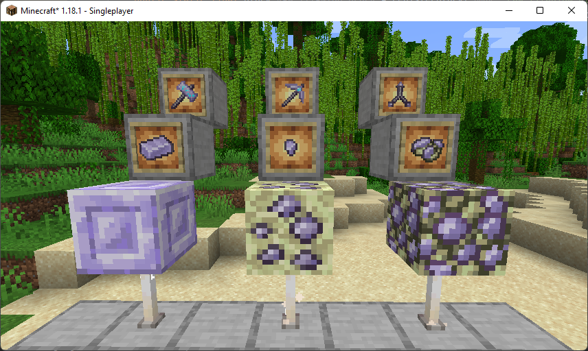

# TitanoMod-1.18.1 

<!--
*** Thanks for checking out the Best-README-Template. If you have a suggestion
*** that would make this better, please fork the repo and create a pull request
*** or simply open an issue with the tag "enhancement".
*** Don't forget to give the project a star!
*** Thanks again! Now go create something AMAZING! :D
-->

<!-- PROJECT SHIELDS -->
<!--
*** I'm using markdown "reference style" links for readability.
*** Reference links are enclosed in brackets [ ] instead of parentheses ( ).
*** See the bottom of this document for the declaration of the reference variables
*** for contributors-url, forks-url, etc. This is an optional, concise syntax you may use.
*** https://www.markdownguide.org/basic-syntax/#reference-style-links
-->

<!-- PROJECT LOGO -->
 

  

  
    A Minecraft Mod i have been creating during and for my Facharbeit about Game-Modifications
  

<!-- ABOUT THE PROJECT -->
## About The Project

### Built With

* [FabricMC](https://github.com/FabricMC)
* Mixin

<!-- GETTING STARTED -->
## Getting Started

To install this mod, you need to have the Fabric Modloader and a license for Java Minecraft.

### Installation

1. do something
2. do more
3. do much important very many important

<!-- USAGE EXAMPLES -->
## Usage

Use this space to show useful examples of how a project can be used. Additional screenshots, code examples and demos work well in this space. You may also link to more resources.

<!-- ROADMAP -->
## Roadmap

- [ ] Add a Roadmap
  

(<a href="#top">back to top</a>)
